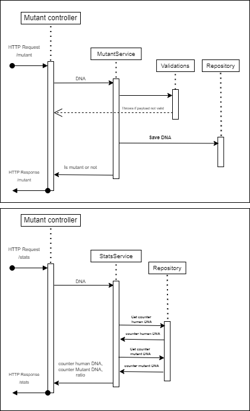

# Projecto Mutant validator 

La finalidad de este servicio es validar secuencias de ADN para determinar el ratio entre ADN mutante y no mutante.

## Fujo del proceso

El proceso para analizar y validar secuencias de ADN es el siguiente:
Se requiere invocar el servicio desde el endpoint: /mutant
Al recibir la petición elñ servicio validará que sea util para intentar procesarla, una vez validad, 
se almacenara en base de datos (MongoDB), para que se pueda tener un registro de cada ADN validado.

En caso que la peticion no contenga una carga util, el servicio respondera con un codigo 403 Forbidden.

El servicio tambien cuenta con un endpoint dedicado para obtener las estadisticas sobre los ADNs sometidos a evaluación, 
el cual se invoca desde el siguiente endpoint: /stats
Este endpoint no requiere de una carga util, solo requiere de generar la petición para que regrese las estadisticas.




## 📝 Requisitos de ejecución. 

- java 11 + 
- Maven 3.6.X
- Mongo DB
>**Nota**: El proyecto ya tienen configurada una base de datos por default la cual está desplegada en la nube de Mongo
> Se puede utilizar esta misma base o se puede reemplazar por la conexion de preferencia, siempre y cuando se reemplaze
> la cadena de conexíon dentro del archivo application.properties en la ruta del proyecto: ./src/resources/application.properties
> Sustituir el contenido de la propiedad connection_chain

## 🔨 Compilación:

- java 11 +
- Maven 3.6.X

>**Nota**: Este proyecto se construyo con el framework Quarkus.

## Correr tu aplicacion en ambiente de desarrollo

Puede ejecutar la aplicación en modo de desarrollo que habilite la codificación en vivo mediante:
```shell script
./mvnw compile quarkus:dev
```

## ⚙ Empaquetando y corriendo el servicio

El servicio puede ser empaquetado usando el siguiente comando en terminal:
```shell script
./mvnw package
```
Este produce el archivo `quarkus-run.jar` en la ruta del proyecto `target/quarkus-app/`.
Recuerda, este servicio no empaqueta las dependencias en el mismo jar, asi que las encontraras en la ruta `target/quarkus-app/lib/`

La aplicacion puede ser ejecutada con el siguiente comando en terminal `java -jar target/quarkus-app/quarkus-run.jar`.

Si deseas que se empaqueten las dependencias utiliza el siguiente comando:
```shell script
./mvnw package -Dquarkus.package.type=uber-jar
```
La aplicacion puede ser ejecutada con el siguiente comando en terminal  `java -jar target/*-runner.jar`.

## 📍 Endpoints
- /mutant
  - Permite evaluar si e un array de secuencias de ADN de las dimenciones NxN
    - ```json
          {
            "dna": [
                      "ATGCGA",
                      "CAGTGC",
                      "TTATGT",
                      "AGAAGG",
                      "CCCCTA",
                      "TCACTG"
            ]
          }
      ```
    - Respuesta del servicio: 
    - 200 (OK) : El ADN se detecto como mutante
    - 403 (Forbbiden) : El ADN no se no se detecto al de un mutante o no tiene la estructura adecuada
- /stats
  - Permite obtener las estadisticas de los ADNs evaluados previamente
    - La respuesta debera ser similar a la siguiente mostrada
      - ```json
        {
           "count_human_dna": 5,
           "count_mutant_dna": 3,
           "ratio": 0.6
         }
        ```
      - En donde:
      - count_human_dna: contiene los ADNs de humanos validados
      - count_mutant_dna: contiene los ADNs de mutantes validados
      - ratio: Relacion entre mutantes y no mutantes (count_mutant_dna/count_human_dna)
## Test
Para ejecutar las pruebas del servicio y determinar la covertura correr el siguiente comando:
```shell script
./mvnw mvn clean test
```
>**Nota**: La covertura de las pruebas unitarias se almacenara en la ruta /target/site/index.html

## 🚀 Despilegue

Este servicio fue subido a la nube de GCP, configurando un app engine y desplegado con los siguientes comandos

```shell script
 gcloud init
```
Este comando permite inicializar el proyecto, para poder elegir, hacia que proyecto de CGP sera desplegado

```shell script
 gcloud app deplou
```
Este comando hara el despliegue para el app engine del proyecto seleccionado

### 📝 Requisitos de ejecución.
- python3
- gcloud sdk


### Ejecutar el servicio en la nube

Puedes ejecutar el servicio desde la nube, utilizando postman o cualquiera sea la herramienta de preferencia para realizar peticiones HTTP.

Abajo añado el CURL del servicio para usarlo desde postman. 

### /mutant
>curl --location --request POST 'https://grand-practice-355902.uc.r.appspot.com/mutant' \
--header 'Content-Type: application/json' \
--data-raw '{
"dna":["ATGCGA", "CAGTGC", "TTATGT", "AGAAGG", "CCCCTA", "TCACTG"]
}'

### /stats

>curl --location --request POST 'https://grand-practice-355902.uc.r.appspot.com/stats' \
--header 'Content-Type: application/json' \
--data-raw ''

